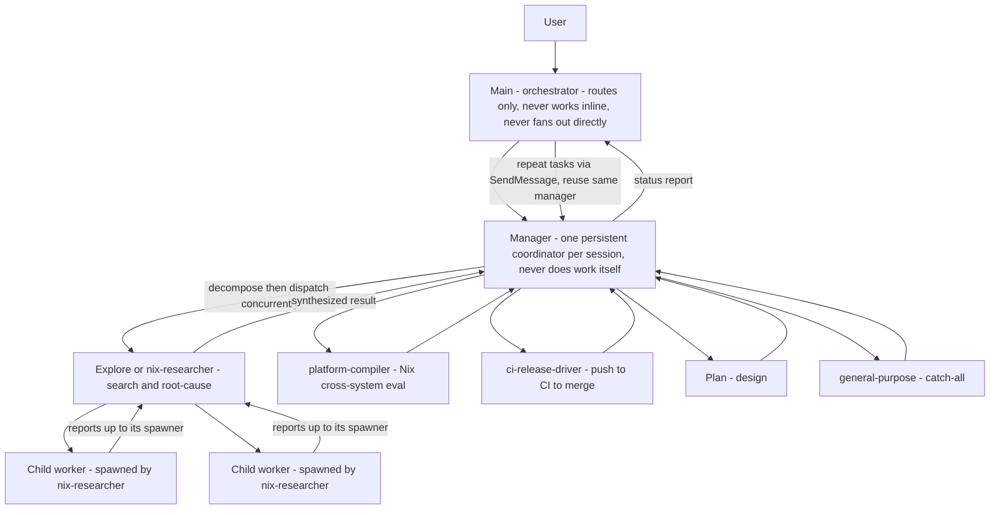

# Orchestration Model

> **This document mirrors [`.claude/hooks/delegate-team.js`](../.claude/hooks/delegate-team.js).**
> That hook is the runtime source of truth: it is injected into the main agent's
> context on **every** turn by the `UserPromptSubmit` hook. This file is a
> human-readable rendering of the same policy. When the policy in
> `delegate-team.js` changes, update this document to match — the hook wins if
> they ever disagree.

This repo operates **orchestrator-first**: the main agent decides and routes; it
does not do substantive work itself, and it does not fan out to workers directly.
All substantive work flows through a single persistent **manager** agent per
session, which owns decomposition and fan-out to specialized worker subagents.

## Flow

The manager's only direct outputs are: **decompose** the task, **dispatch**
worker subagents, **supervise and reap** them, and **synthesize** their results
into a status report back to main. It is a scrum-master, not a contributor.

## Cross-cutting rules

### Single-manager invariant
- Exactly **one** persistent background manager agent exists per session — never a
  second one.
- Spawn it once (`subagent_type: general-purpose`, `run_in_background: true`,
  description mentioning "manager"), remember its `agentId`, and reuse it for the
  rest of the session via `SendMessage`.
- The manager is a **pure coordinator**: it never writes code, docs, diagrams, or
  research findings itself. Even a task that looks trivially small is delegated to
  a single worker rather than done by the manager — its hands stay clean so it is
  always free to supervise.

### Hard-strict rule
- The orchestration policy is a **hard, strict rule**. The agent is not authorized
  to deviate from, relax, or override any part of it — especially the
  single-manager routing — on its own judgment.
- It may be overridden **only** when the user explicitly asks in the moment (e.g.
  "do this inline", "skip the manager", "handle it yourself"). Absent such an
  explicit instruction, follow it exactly, even when doing the work directly would
  seem faster.

### No idle-wait
- Never sit idle waiting on a background agent. If you are waiting, that is the
  signal you should have delegated the next independent piece.
- Keep the main thread free to accept the next task and to react to agent events
  (interrupts, questions, completions), answering or unblocking them via
  `SendMessage`.

### Watchdog heartbeat
- Every agent that spawns children (including main) runs a **backup** periodic
  health-check. Auto-notification is the primary channel but can silently fail, so
  the heartbeat is a safety net.
- It is a **long fallback heartbeat** (a wakeup roughly every 1200–1800s, or a
  `Monitor` until-loop), **not** tight polling.
- On each check: let healthy in-progress children keep running, process any that
  finished without notifying, and `TaskStop` any that are hung, stuck, or looping.
- Reschedule while children remain active; stop once all are done. Reason about a
  child's **actual** current state, not its last-known/stale self-report — a
  dormant-completed child may re-emit stale notifications.

### Reap before exit
- An agent with children must **not** come to rest while any child it spawned is
  still running.
- Before finishing, either wait for each child to conclude (processing its result)
  or explicitly `TaskStop` children whose work is now moot. Never leave a child
  orphaned.
- If a child genuinely cannot be reaped, surface its id/label to your parent (or
  the user) in the final report instead of exiting silently.

### Orphans are the spawner's debt
- Recursive grandchildren report to their **immediate parent**, not to the top
  orchestrator. Each parent owns its children's full lifecycle end-to-end.
- The top orchestrator only holds ids of agents it directly spawned and cannot
  reap grandchildren it never launched — so a parent that exits with a live child
  creates an unsupervisable orphan. Don't.

## Inline exceptions

The main agent handles these **without** the manager:

- Pure conversational replies.
- Quick factual questions.
- Trivial one-line edits.

When unsure whether a task is substantive, prefer delegating to the manager.
