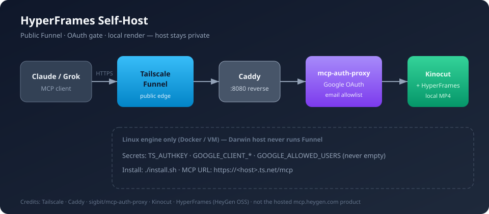
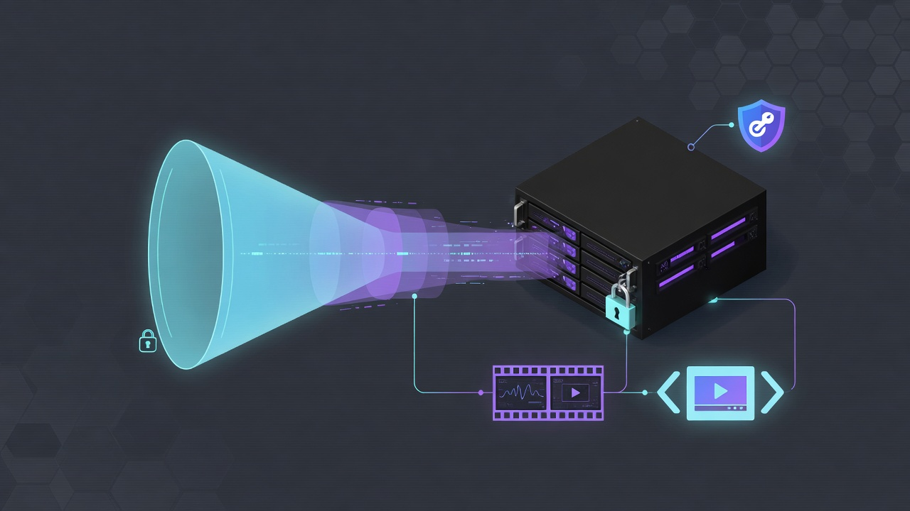
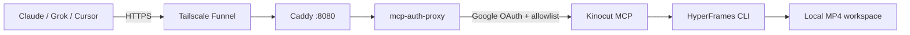

# HyperFrames Self-Host

[](https://github.com/ismailkattakath/hyperframes-selfhost/actions/workflows/ci.yml)
[](https://github.com/ismailkattakath/hyperframes-selfhost/actions/workflows/nightly.yml)
[](https://securityscorecards.dev/viewer/?uri=github.com/ismailkattakath/hyperframes-selfhost)
[](./LICENSE)
[](https://tailscale.com/docs/features/tailscale-funnel)
[](./CONTRIBUTING.md)

**Self-host a Kinocut + HyperFrames MCP** behind Google OAuth and Tailscale Funnel — local renders, no HeyGen cloud credits, host machine stays private.

> **Not** the HeyGen-hosted product at `mcp.heygen.com`. That MCP is cloud-only.  
> This project packages the **open-source** HyperFrames renderer with Kinocut’s MCP surface.

<p align="center">
  
</p>

<p align="center">
  
</p>



## Why this exists

| You want | You get |
| --- | --- |
| Public MCP URL for cloud agents | Funnel only (no open home-router ports) |
| Real OAuth for connectors | [mcp-auth-proxy](https://github.com/sigbit/mcp-auth-proxy) + Google Web client |
| Email allowlist | `GOOGLE_ALLOWED_USERS` (never leave empty) |
| Local video tools | [Kinocut](https://github.com/KyaniteLabs/kinocut) + [HyperFrames](https://github.com/heygen-com/hyperframes) |
| No Nix required | `./install.sh` + Docker Compose |

## Quick start

```bash
git clone https://github.com/ismailkattakath/hyperframes-selfhost.git
cd hyperframes-selfhost
cp .env.example .env
# Fill: TS_AUTHKEY, GOOGLE_CLIENT_ID, GOOGLE_CLIENT_SECRET, GOOGLE_ALLOWED_USERS
./install.sh
```

Then:

1. Add Google redirect URI printed by install:  
   `https://<host>.ts.net/.auth/google/callback`
2. Connect MCP client to:  
   `https://<host>.ts.net/mcp`
3. Log in with an allowlisted Google account

Full checklist: [docs/SETUP.md](./docs/SETUP.md)

## Security posture

| Control | Mechanism |
| --- | --- |
| Auth | OAuth 2.1 via mcp-auth-proxy (PKCE / DCR-friendly clients) |
| Authorization | Exact email allowlist (CSV); empty list is forbidden by entrypoint |
| Exposure | Funnel on Linux engine only — not on your laptop’s Funnel by default |
| Secrets | `.env` gitignored; never in image layers |
| Supply chain | Dependabot, Trivy, Gitleaks, Hadolint, ShellCheck, nightly CI, Scorecard |

**No Codecov badge on purpose.** This is packaging/infra, not an app library — coverage % would be theater. We invest in **config validation + security scanners** instead. See [CONTRIBUTING.md](./CONTRIBUTING.md).

Report vulnerabilities privately: [SECURITY.md](./SECURITY.md).

## Credits & upstream

This packaging stands on excellent open work:

| Project | Role | Link |
| --- | --- | --- |
| **HyperFrames** (HeyGen OSS) | HTML → deterministic video | [github.com/heygen-com/hyperframes](https://github.com/heygen-com/hyperframes) · [docs](https://hyperframes.heygen.com/) |
| **Kinocut** | Guardrailed video MCP + HyperFrames tools | [github.com/KyaniteLabs/kinocut](https://github.com/KyaniteLabs/kinocut) · [kinocut.dev](https://kinocut.dev/) |
| **mcp-auth-proxy** | Drop-in MCP OAuth 2.1 gateway | [github.com/sigbit/mcp-auth-proxy](https://github.com/sigbit/mcp-auth-proxy) |
| **Tailscale Funnel** | Public HTTPS without inbound NAT | [tailscale.com/docs](https://tailscale.com/docs/features/tailscale-funnel) |
| **Caddy** | Reverse proxy | [caddyserver.com](https://caddyserver.com/) |
| **Mother flake** (optional) | Nix/Terranix forge for maintainers | [github.com/kattakath/nix-config](https://github.com/kattakath/nix-config) |

All trademarks remain with their owners. **Not affiliated with HeyGen’s hosted HyperFrames MCP.**

## Ops

```bash
docker compose ps
docker compose logs -f
./scripts/doctor.sh
./scripts/ci-static.sh   # same static gates as CI
```

Disable public edge: `docker exec hf-tailscale tailscale funnel --https=443 off`

## Releases

- Tags: `vMAJOR.MINOR.PATCH` (SemVer) → GitHub Release + source archive  
- Changelog: [CHANGELOG.md](./CHANGELOG.md)  
- Nightly: static gates on a schedule  

## Contributing

See [CONTRIBUTING.md](./CONTRIBUTING.md) and [CODE_OF_CONDUCT.md](./CODE_OF_CONDUCT.md).  
Issue templates and PR checklist live under `.github/`.

Independent forks need **no Nix**. Upstream maintainers regenerate Terraform JSON from the mother flake — see [UPSTREAM.md](./UPSTREAM.md).

## License

Apache-2.0 — [LICENSE](./LICENSE). Third-party components keep their own licenses.
